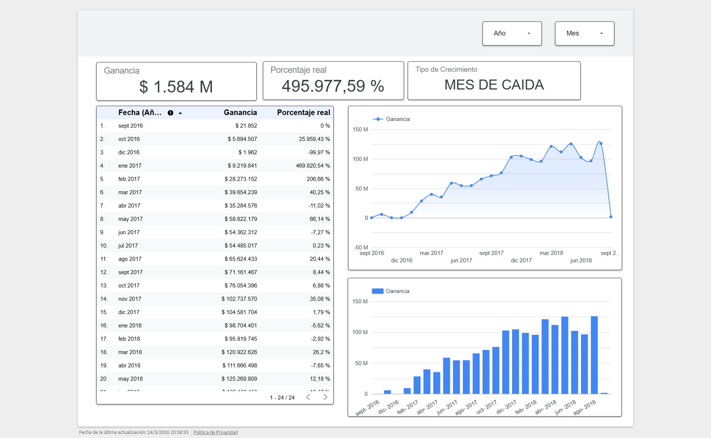
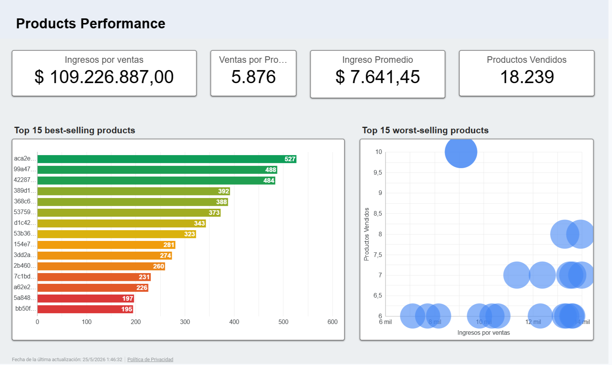
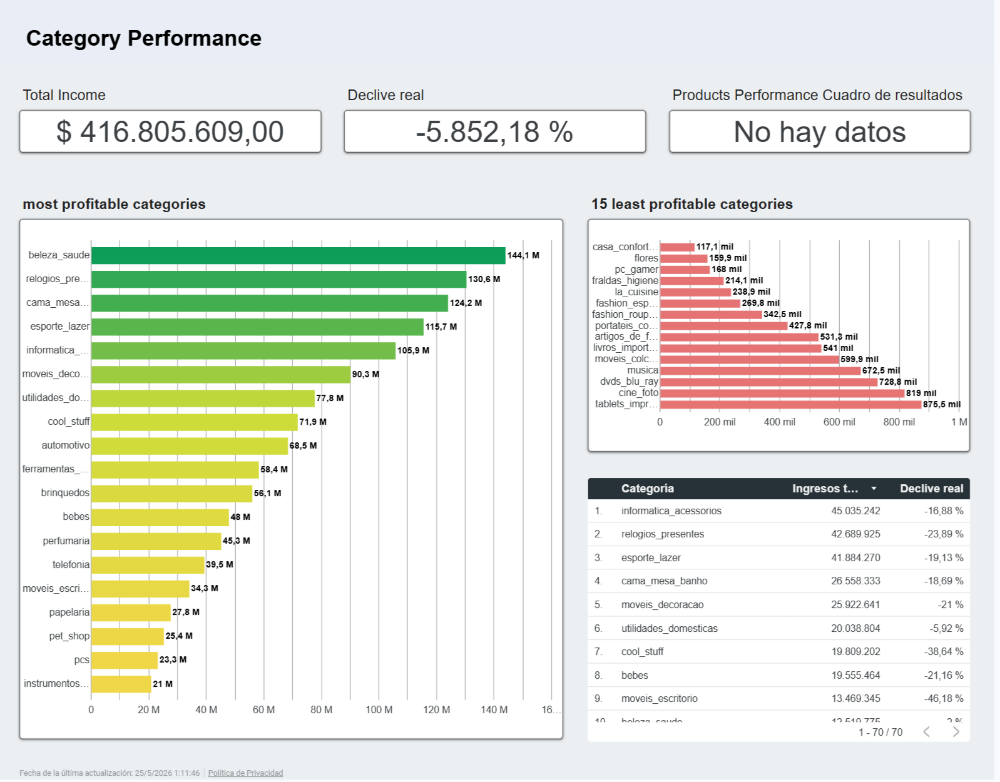
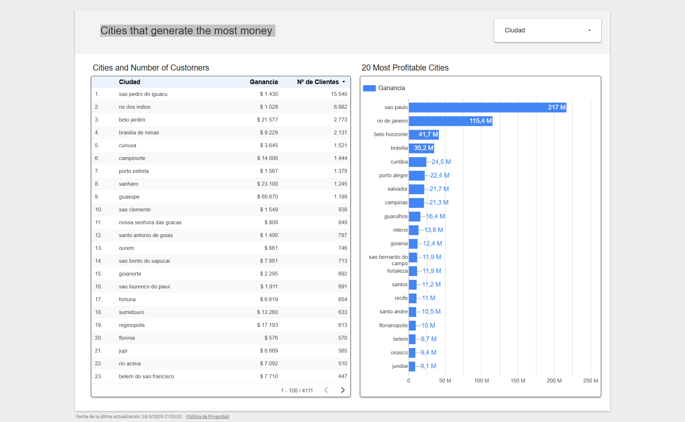
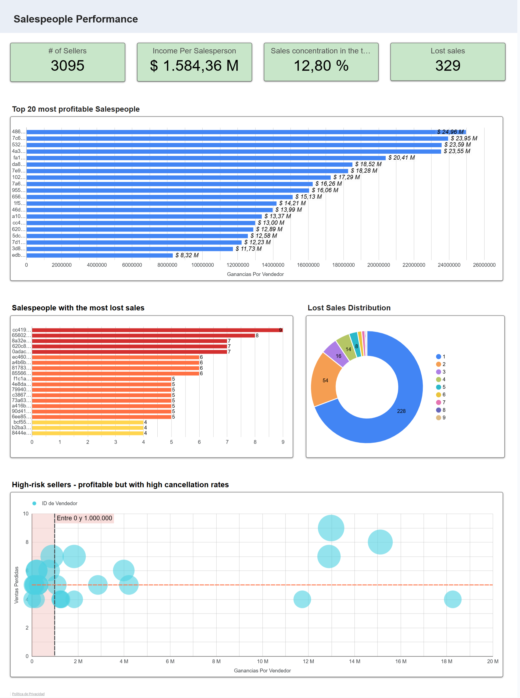

# Análisis de Ventas Ecommerce - OLIT

🌐 Idiomas: [English](README.md) | [Español](README.es.md)

---

## Proyecto de Ecommerce Analytics orientado a Negocio

Este proyecto analiza datos de ventas ecommerce utilizando SQL y visualización de datos para entender tendencias de ingresos, desempeño de productos y categorías, concentración geográfica de ventas y desempeño de vendedores.

El objetivo del análisis es traducir datos de ecommerce en insights prácticos de negocio que ayuden a tomar mejores decisiones sobre crecimiento de ventas, estrategia de productos, oportunidades regionales, monitoreo de vendedores y experiencia del cliente.

> Nota: Este proyecto está basado en un dataset público de ecommerce encontrado en Kaggle. El análisis fue estructurado como un caso de negocio para portafolio de Data Analytics.

---

## Contexto de Negocio

Los negocios ecommerce generan grandes volúmenes de datos transaccionales y operativos relacionados con órdenes, clientes, productos, vendedores, pagos, reseñas y procesos de entrega.

Desde una perspectiva de negocio, el desafío no es solamente calcular métricas, sino entender:

- Cómo evolucionan los ingresos a lo largo del tiempo.
- Qué productos y categorías impulsan el desempeño del negocio.
- Dónde se concentran geográficamente las ventas y los clientes.
- Qué vendedores pueden representar valor comercial o riesgo operativo.
- Qué acciones podrían mejorar ventas, estrategia de producto, logística y experiencia del cliente.

Este proyecto aborda el dataset desde una mirada de análisis de negocio, combinando SQL, dashboards y storytelling con datos.

---

## Preguntas de Negocio

El análisis fue guiado por cuatro preguntas principales de negocio:

1. **¿Cómo han evolucionado los ingresos del ecommerce a lo largo del tiempo?**

2. **¿Qué productos y categorías están generando más ingresos?**

3. **¿Qué ciudades o regiones generan más ventas y clientes?**

4. **¿Qué vendedores o problemas operativos pueden estar afectando la experiencia del cliente?**

Estas preguntas fueron pensadas para apoyar mejores decisiones de ecommerce, no solamente para describir métricas del dataset.

---

## Herramientas Utilizadas

- SQL
- Google Sheets / Excel
- Looker Studio / Power BI
- Ecommerce analytics
- Análisis de negocio
- Diseño de dashboards
- Storytelling con datos

---

## Dataset

El dataset incluye información relacionada con ecommerce, como:

- Órdenes
- Clientes
- Productos
- Vendedores
- Pagos
- Reseñas
- Fechas de entrega
- Categorías de productos
- Información geográfica

Principales tipos de campos analizados:

- Fecha de orden
- Ingresos
- Categoría de producto
- Ubicación del cliente
- Información del vendedor
- Valor de pago
- Costo de envío
- Puntaje de reseña
- Tiempo de entrega
- Estado de la orden

- > Nota: Este proyecto está basado en un dataset público de ecommerce encontrado en Kaggle. El análisis fue estructurado como un caso de negocio para portafolio de Data Analytics.

**Fuente del dataset:** [Kaggle - Olist Brazilian Ecommerce Dataset](https://www.kaggle.com/datasets/olistbr/brazilian-ecommerce)

---

## Proceso de Análisis

El proyecto siguió este proceso:

1. Comprender el contexto de negocio del ecommerce.
2. Revisar las tablas disponibles y sus relaciones.
3. Definir preguntas relevantes de negocio.
4. Preparar y consultar los datos utilizando SQL.
5. Analizar ingresos, productos, categorías, geografía y desempeño de vendedores.
6. Construir dashboards y evidencia visual para comunicar resultados.
7. Extraer insights clave.
8. Traducir los hallazgos en recomendaciones de negocio.

---

## Métricas Clave

Las principales métricas analizadas incluyen:

- Ingresos totales
- Ingresos mensuales
- Crecimiento o caída de ingresos
- Volumen de ventas por producto
- Ingreso promedio
- Ingresos por categoría de producto
- Categorías en declive
- Ingresos por ciudad
- Cantidad de clientes por ciudad
- Ingresos por vendedor
- Ventas perdidas o canceladas
- Indicadores de riesgo por vendedor

---

## Análisis SQL

El análisis SQL está organizado alrededor de las cuatro preguntas de negocio:

### 1. Revenue Performance

Esta sección analiza cómo evolucionaron los ingresos del ecommerce a lo largo del tiempo, incluyendo ingresos mensuales, períodos de crecimiento, períodos de caída y tendencias generales.

### 2. Product & Category Performance

Esta sección identifica productos más vendidos, categorías con mayores ingresos, categorías en declive y productos con alto volumen pero menor contribución de ingresos.

### 3. Geographic Sales Performance

Esta sección analiza qué ciudades generan más ventas y qué ciudades concentran la mayor cantidad de clientes.

### 4. Seller Performance

Esta sección identifica vendedores con mayores ingresos, vendedores asociados con ventas perdidas y vendedores que pueden requerir monitoreo operativo.

Archivo SQL:

```text
sql/01_business_questions.sql
```

---

## Dashboards / Evidencia Visual

### 1. Evolución de ingresos a lo largo del tiempo



Este dashboard muestra cómo evolucionaron los ingresos del ecommerce a lo largo del tiempo.

La visualización muestra una tendencia fuerte de crecimiento desde finales de 2016 hasta gran parte de 2018. Sin embargo, el último período muestra una caída marcada, que debe interpretarse con cuidado porque el dataset puede tener registros incompletos en el período más reciente.

Esta vista ayuda a identificar períodos de crecimiento, períodos de caída y momentos donde el negocio necesita una revisión más profunda antes de sacar conclusiones definitivas sobre la evolución de ingresos.

---

### 2. Vista general de desempeño de productos



Este dashboard analiza el desempeño a nivel producto, incluyendo ingresos por ventas, productos vendidos, ingreso promedio y productos con mayor volumen de venta.

El análisis muestra que un grupo reducido de productos concentra una parte importante del volumen de ventas. Esto ayuda a identificar qué productos están impulsando la demanda y cuáles podrían recibir mayor visibilidad, soporte de inventario o foco comercial.

El dashboard también incluye una vista de productos con menor desempeño, lo cual puede apoyar decisiones de pricing, surtido o revisión comercial.

---

### 3. Vista general de desempeño por categoría



Este dashboard analiza el desempeño de ingresos por categoría de producto.

La visualización muestra que los ingresos se concentran en un grupo de categorías de alto desempeño, incluyendo categorías como belleza/salud, relojes/regalos, cama/mesa/baño, deporte/ocio y productos relacionados con tecnología.

También incluye una vista de categorías menos rentables o en declive. Estas categorías pueden requerir una revisión más profunda antes de tomar decisiones de marketing, inventario o estrategia de producto.

---

### 4. Desempeño geográfico de ventas



Este dashboard analiza la concentración de ventas y clientes por ciudad.

La visualización muestra que los ingresos están fuertemente concentrados en ciudades principales, con São Paulo y Rio de Janeiro liderando el desempeño comercial por amplio margen.

Este análisis ayuda a identificar mercados prioritarios para marketing regional, planificación logística, adquisición de clientes y expansión comercial.

---

### 5. Vista general de desempeño de vendedores



Este dashboard analiza el desempeño de vendedores desde una perspectiva comercial y operativa.

Muestra los vendedores que generan más ingresos, vendedores asociados con ventas perdidas o canceladas, y vendedores que podrían representar riesgo operativo por combinar ingresos relevantes con problemas de cancelación.

Esta vista es útil para identificar vendedores clave, monitorear riesgos operativos y mejorar la experiencia del cliente mediante una mejor gestión de vendedores y logística.

---

## Insights Principales

Principales insights identificados durante el análisis:

1. **Los ingresos muestran una tendencia fuerte de crecimiento, pero el último período requiere cuidado.**  
   La tendencia de ingresos creció de forma importante desde finales de 2016 hasta gran parte de 2018. Sin embargo, la caída final debe revisarse con cuidado porque puede estar afectada por datos incompletos.

2. **La demanda de productos está concentrada en un grupo reducido de productos más vendidos.**  
   El dashboard de productos muestra que una pequeña cantidad de productos genera un alto volumen de ventas, lo cual puede representar una oportunidad para priorización de inventario o foco promocional.

3. **Algunas categorías concentran una gran parte de los ingresos.**  
   Categorías como belleza/salud, relojes/regalos, cama/mesa/baño, deporte/ocio y categorías relacionadas con tecnología aparecen como fuertes generadoras de ingresos.

4. **Las ventas están geográficamente concentradas en ciudades principales.**  
   São Paulo y Rio de Janeiro generan el mayor valor de ventas, lo que sugiere que la estrategia regional y logística debería priorizar ciudades de alto valor comercial.

5. **El desempeño de vendedores debe monitorearse desde ingresos y riesgo operativo.**  
   Algunos vendedores generan ingresos importantes, pero aquellos con cancelaciones o ventas perdidas pueden requerir revisión operativa para proteger la experiencia del cliente.

---

## Recomendaciones de Negocio

A partir del análisis, se recomiendan las siguientes acciones:

1. **Revisar la tendencia de ingresos considerando la completitud de los datos.**  
   Antes de sacar conclusiones definitivas sobre crecimiento, el negocio debería validar si el último período está completo o parcialmente registrado.

2. **Priorizar productos y categorías de alto desempeño.**  
   Los productos y categorías con alto volumen de ventas o altos ingresos deberían recibir mayor visibilidad comercial, atención de inventario y soporte de marketing.

3. **Investigar categorías en declive o con bajo desempeño.**  
   Las categorías con menor rendimiento deberían revisarse para entender si el problema está en demanda, precio, surtido, estacionalidad o disponibilidad operativa.

4. **Enfocar acciones regionales en ciudades de mayor valor.**  
   Ciudades como São Paulo y Rio de Janeiro deberían priorizarse para marketing regional, optimización de entregas y estrategias de adquisición de clientes.

5. **Crear un sistema de monitoreo de vendedores.**  
   Los vendedores deberían evaluarse no solo por ingresos, sino también por cancelaciones, ventas perdidas, comportamiento logístico y riesgo operativo.

---

## Estructura del Repositorio

```text
ecommerce-sales-analysis-olit/
│
├── README.md
├── README.es.md
│
├── sql/
│   └── 01_business_questions.sql
│
└── images/
    ├── revenue-evolution-over-time.png
    ├── product-performance-overview.png
    ├── category-performance-overview.png
    ├── top-revenue-cities.png
    └── seller-performance-overview.png
```

---

## Estado del Proyecto

En progreso.

Completado:

- Archivo SQL con preguntas de negocio.
- README en inglés.
- README en español.
- Capturas de dashboards / evidencia visual.
- Insights principales.
- Recomendaciones de negocio.

Próximos pasos:

- Validar que las imágenes se lean correctamente en GitHub.
- Revisar formato del archivo SQL.
- Agregar links de dashboards si el acceso público está disponible.
- Agregar link al dataset si es necesario.

---

## Sobre Este Proyecto

Este proyecto forma parte de mi portafolio de Data Analytics.

Mi enfoque es conectar el análisis técnico con decisiones reales de negocio combinando:

- Análisis SQL
- Entendimiento de negocio ecommerce
- Diseño de dashboards
- Storytelling con datos
- Recomendaciones accionables
